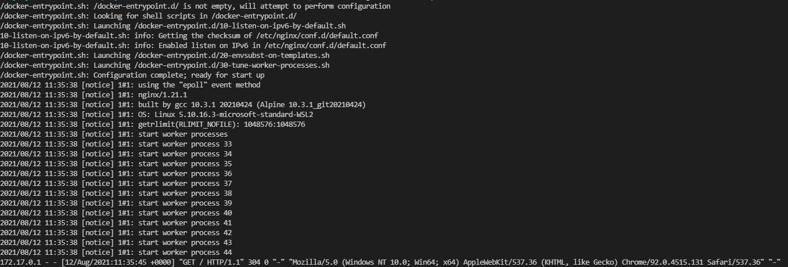
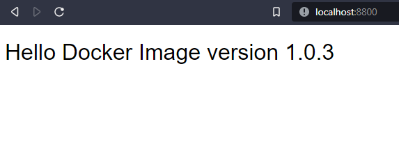

# 1. Docker simple
## 1.1. Summary
For this example, I create a container that runs the Nginx server. I use the nginx:alpine image because it is small.  
To download the image, I use the command `docker pull nginx:alpine`.  


## 1.2. Run
```
docker run -ti -p 8800:80 docker-simple:1.0.3
```
To start a container in detached mode, you use `-d` option. If you use `-d` with `--rm`, the container is removed when it exits or when the daemon exits, whichever happens first. It is also a good idea to use container naming `--name <containername>`

```
docker run -ti --name docker-simple --rm -d -p 8800:80 docker-simple:1.0.3
```
## 1.3. Check
- logs
```
docker logs -f docker-simple
```

- web browser [http://localhost:8800/](http://localhost:8800/)  


---
[link to the original article ](https://medium.com/myriatek/using-docker-to-run-a-simple-nginx-server-75a48d74500b)