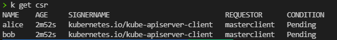
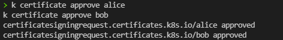
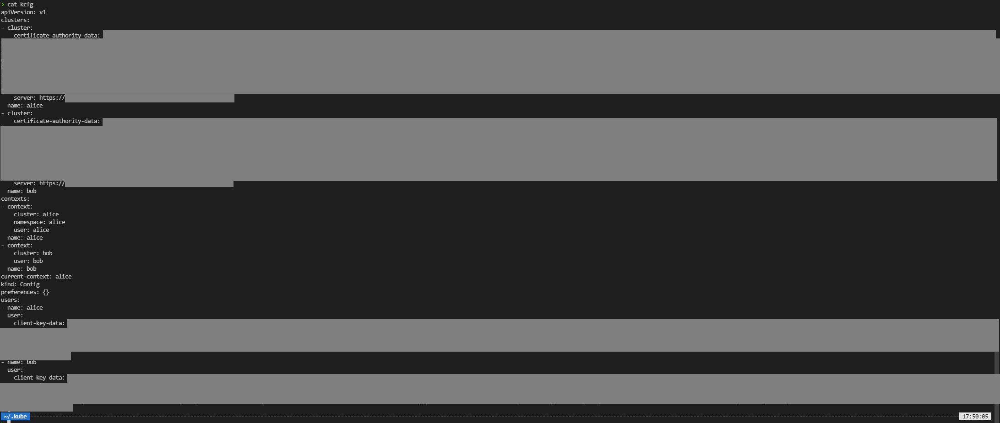

# Úkol
- podívat se na agregované role
- zadání:
	- cluster napojit na Trask ID (viz. ukázka) - N/A
	- namespace "alice" - DONE
	- namespace "bob" - DONE
	- namespace "developers" - DONE
	- uživatel "alice" - přes certifikát, ve skupině "developers" - DONE *
	- uživatel "bob" - přes certifikát, ve skupině "developers"- DONE *
	- uživatel "alice" adminem v namespace "alice"- DONE
	- uživatel "bob" adminem v namespace "bob"- DONE
	- skupina "developers" má R/W práva v namespace "developers" - NONE
	- uživatel "alice" má R/O práva v namespace "bob", ale na configMaps má R/W - NONE
	- uživatel "bob" má R/O práva v namespace "alice", ale na configMaps má R/W - NONE
	- serviceAccount "monitor" v namespace "default" má R/O práva v namespace "bob", "alice", "developers" - NONE
	- serviceAccount "audit" v namespace "default" má R/O práva na vše v clusteru - NONE
	- vytvořit namespacované CRD (DODÁM) a přidat práva na jeho CR do agregovaných rolí view/edit/ admin - NONE
	- skupina "Trask employees" má právo čtení configMap v namespace "kube-system" a "default" - NONE
	- v souboru kcfg nakonfigurovat kubectl kontexty "bob", "alice", "admin", "oidc", "monitor", "audit" - první dva jsou o uživatelích, třetí je cluster admin, čtvrtý je váš Traskový účet a poslední dva jsou o serviceAccount - NONE
# postup

## Vytvořit 3 namespace
- alice
- bob
- developers
```
kubectl create namespace alice
kubectl create namespace bob
kubectl create namespace developers
```

## vytvořit žádost o retifikát (součástí je klíčový pár)
```
openssl req -new -newkey rsa:1024 -keyout alice.pem -nodes -out - -subj "/CN=alice/O=developers" 2>/dev/null | base64 -w0 > alice.csr
openssl req -new -newkey rsa:1024 -keyout bob.pem -nodes -out - -subj "/CN=bob/O=developers" 2>/dev/null | base64 -w0 > bob.csr
cat <<EOF | kubectl create -f -
apiVersion: certificates.k8s.io/v1
kind: CertificateSigningRequest
metadata:
  name: alice
spec:
  request: $(cat alice.csr)
  signerName: kubernetes.io/kube-apiserver-client
  usages:
  - client auth
EOF
cat <<EOF | kubectl create -f -
apiVersion: certificates.k8s.io/v1
kind: CertificateSigningRequest
metadata:
  name: bob
spec:
  request: $(cat bob.csr)
  signerName: kubernetes.io/kube-apiserver-client
  usages:
  - client auth
EOF
```
kontrola
```
k get csr
```
- 


## schválit žádost
```
k certificate approve alice
k certificate approve bob
```
- 

opet kontrola


uživatelé alice abob aby byli adminem ve svých namespace. Na to se použije přiřazení cluster rolí rolebinding
```
k create rolebinding alice-admin -n alice --clusterrole=admin --user=alice
k create rolebinding bob-admin -n bob --clusterrole=admin --user=bob
```

Ignorovat test
```
k get rolebindings.rbac.authorization.k8s.io -A -o=jsonpath="{range .items[*]}{.roleRef.kind}"
$b=kubectl get rolebindings.rbac.authorization.k8s.io -A -o json |ConvertFrom-Json -AsHashtable  
($b.items| where {$_.roleRef.kind -like "ClusterRole"} | select metadata).metadata.name

pwsh -command (kubectl get rolebindings.rbac.authorization.k8s.io -A -o json |ConvertFrom-Json -AsHashtable).items | (where {$_.roleRef.kind -like "ClusterRole"} | select metadata).metadata.name
```
## Export Kubeconfig
```
cd ~/.kube
export KUBECONFIG=./kcfg
kopírovat pem do ~/.kube
cp /home/cmajda2/projects/trask/learning/k8s/Tasks/Level_7/alice.pem .
cp /home/cmajda2/projects/trask/learning/k8s/Tasks/Level_7/bob.pem .
```
## Install yq
```
sudo apt-key adv --keyserver keyserver.ubuntu.com --recv-keys CC86BB64
sudo add-apt-repository ppa:rmescandon/yq
sudo apt update
sudo apt install yq -y
```
## vytvořit cluster alice
```
k config set-cluster alice --server $(KUBECONFIG=./config kubectl config view --minify | yq e '.clusters[0].cluster.server' - )
k config set-cluster alice --embed-certs --certificate-authority <(KUBECONFIG=./config kubectl config view --minify --raw | yq e '.clusters[0].cluster.certificate-authority-data' - | base64 -d)
k config set-credentials alice --embed-certs --client-key alice.pem --client-certificate <(KUBECONFIG=./config kubectl get csr alice -o jsonpath='{.status.certificate}' | base64 -d)
k config set-context alice --cluster alice --user alice --namespace=alice
k config use-context alice
```

## Vytvořit cluster bob
```
k config set-cluster bob --server $(KUBECONFIG=./config kubectl config view --minify | yq e '.clusters[0].cluster.server' - )
k config set-cluster bob --embed-certs --certificate-authority <(KUBECONFIG=./config kubectl config view --minify --raw | yq e '.clusters[0].cluster.certificate-authority-data' - | base64 -d)
k config set-credentials bob --embed-certs --client-key alice.pem --client-certificate <(KUBECONFIG=./config kubectl get csr alice -o jsonpath='{.status.certificate}' | base64 -d)
k config set-context bob --cluster bob --user bob
k config use-context bob
```
## Kontrola configu `./kcfg`
cat kcfg
	