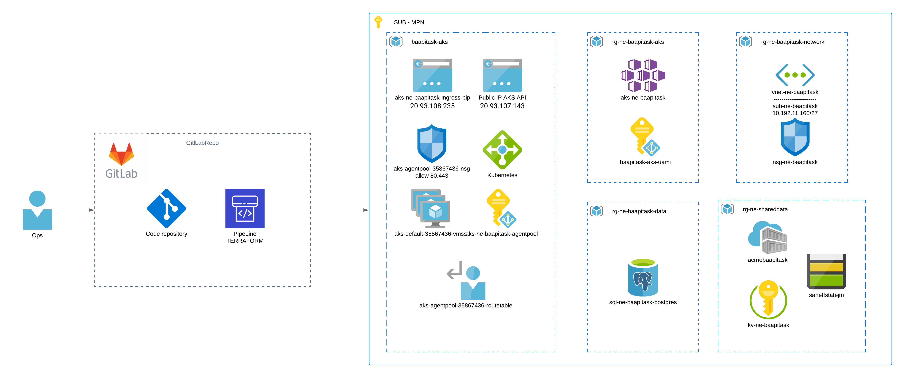
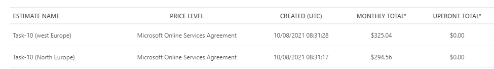

DRAFT
<!-- TOC -->
- [1. Úkol](#1-úkol)
- [2. Návrh](#2-návrh)
- [3. Cennový odhad](#3-cennový-odhad)
- [4. Postup](#4-postup)
	- [4.1. CI/CD Infra (done)](#41-cicd-infra-done)
		- [4.1.1. Pipeline create Infra](#411-pipeline-create-infra)
	- [4.2. CI/CD application (In progress)](#42-cicd-application-in-progress)
		- [4.2.1. Pipeline application](#421-pipeline-application)
- [5. výsledek](#5-výsledek)
<!-- /TOC -->

# 1. Úkol  
- Libovolnou aplikaci
- libovolný CI-CD provider
- vytvořit pipeline která po změně kódu zdrojové aplikace vytvoří image
- udělá push image do vámi zvoleného CR
- vygeneruje nebo upraví Kubernetes manifesty pro deploy této aplikace.

pozn: apply těchto manifestů zatím vynecháme, tzn stačí je pouze vygenerovat a pak apply ručně

# 2. Návrh
- dvě pipeline
  - první na vytvoření infra
  - duhá na build a deploy aplikace
- aplikace nginx statický web server (from image nginx)
- vytvořit index.html obsah "Hurá CI/CD"
- Vytvořit AKS (Azure kubernetes services) - by terraform
- Vytvořit ACR (Azure container registry) - by terraform
- repository GitLab
- CI/CD GitLab

# 3. Cennový odhad
na základě azure kalkulátoru  
[WEST EUROPE](https://azure.com/e/d655bcd6f845423cad92bd29991703a4)  
[NORTH EUROPE](https://azure.com/e/fdf0052df17f4de3946c7d159ff86a9f)  

- rozdíl cca 30$

# 4. Postup

## 4.1. CI/CD Infra (done)
- Terraform vytvoří:
    - AKS (done)
    - ACR (done)
- prereqizity
  - Backend pro tf.state  (done)
    - RG (done)
    - ST (done)
    - Container (done)

### 4.1.1. Pipeline create Infra
 - terraform validate (done)
 - terraform init (done)
 - terraform plan (done)
 - terraform apply (done)

## 4.2. CI/CD application (In progress)

### 4.2.1. Pipeline application
 - build image
 - push
 - deploy

# 5. výsledek
web server v azure automatický deploy/ release při změně kódu 