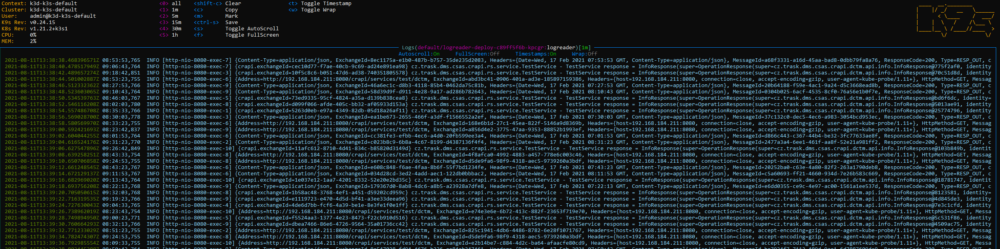

<!-- TOC -->
- [1. Úkol](#1-úkol)
- [2. Příprava image](#2-příprava-image)
  - [2.1. Program `httppublisher.sh`](#21-program-httppublishersh)
  - [2.2. Docker file `Dockerfile`](#22-docker-file-dockerfile)
  - [2.3. Build image](#23-build-image)
  - [2.4. Push image to repository](#24-push-image-to-repository)
    - [2.4.1. Prepare for DockerHub](#241-prepare-for-dockerhub)
    - [2.4.2. Push image to DockerHub](#242-push-image-to-dockerhub)
- [3. Kubernetes vytvořit deploy](#3-kubernetes-vytvořit-deploy)
  - [3.1. Vytvořit yaml `logreader_deploy.yaml`](#31-vytvořit-yaml-logreader_deployyaml)
  - [3.2. Deploy](#32-deploy)
<!-- /TOC -->

# 1. Úkol  
- Vytvořte kontejner s programem (programovým vybavením), který vypisuje jeden náhodný řádek ze souboru (podobně jako v minulém úkolu, jen nyní bude řádek publikován jako HTTP na portu jaký definujete) a tento řádek publikuje jako http response na http request. Opět je jedno jaký programovací jazyk použijete.

# 2. Příprava image

## 2.1. Program `httppublisher.sh`  
```
#!/bin/sh
ROOT_FOLDER="`dirname \"$0\"`"

while :
do { echo -e 'HTTP/1.1 200 OK\r\n'; shuf -n 1 ./$ROOT_FOLDER/input_files/publish.txt; } | nc -l 8181
sleep 10
done
```

## 2.2. Docker file `Dockerfile`  
```
FROM alpine:edge
LABEL name="logreader" \
    authors="mcmajdalka@trask.cz" \
    version="1.0.0"
ENV ROOT_FOLDER=usr/local/bin
RUN adduser -D lsf 
COPY . /${ROOT_FOLDER}/
RUN chmod a+x ./${ROOT_FOLDER}/logreader/logreader.sh
USER lsf
ENTRYPOINT [ "/bin/sh", "./usr/local/bin/logreader/logreader.sh" ]
```

## 2.3. Build image
```
docker build -t cmajda/trask-k8s-httppublisher:1.0.0.
```

## 2.4. Push image to repository
[Pushing a Docker container image to Docker Hub](https://docs.docker.com/docker-hub/repos/#pushing-a-docker-container-image-to-docker-hub)

### 2.4.1. Prepare for DockerHub

```
docker tag logreader:1.0.0 cmajda/trask-k8s-logreader:1.0.0
```
Result
```
REPOSITORY                   TAG            IMAGE ID       CREATED        SIZE
cmajda/trask-k8s-logreader   1.0.0          e54b461afa84   2 hours ago    6.58MB
logreader                    1.0.0          e54b461afa84   2 hours ago    6.58MB
```

### 2.4.2. Push image to DockerHub
```
docker push cmajda/trask-k8s-logreader:1.0.0
```

# 3. Kubernetes vytvořit deploy
[docker docs](https://docs.docker.com/get-started/kube-deploy/#describing-apps-using-kubernetes-yaml)

## 3.1. Vytvořit yaml `logreader_deploy.yaml`
```
apiVersion: apps/v1
kind: Deployment
metadata:
  name: logreader-deploy
spec:
  replicas: 1
  selector:
    matchLabels:
      app: logreader
  template:
    metadata:
      labels:
        app: logreader
    spec:
      restartPolicy: Always
      containers:
        - name: logreader
          image: cmajda/trask-k8s-logreader:1.0.0
          resources: {}

```

## 3.2. Deploy
jít do adresáře kde je uložen `logreader_deploy.yaml` a spustit
```
kubectl apply -f logreader_deploy.yaml
```
odpověď:
```
deployment.apps/logreader-deploy created
```
ověřit zda je vše ok
```
kubectl get deployments
```
odpověď
```
NAME               READY   UP-TO-DATE   AVAILABLE   AGE
logreader-deploy   1/1     1            1           40s
```
kontrola v k9s  

